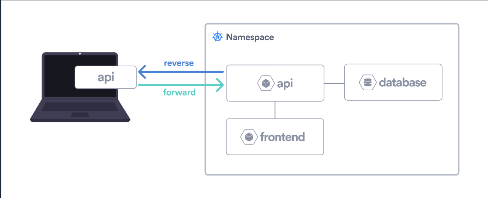

# Movies App using Hybrid development

This example shows how to leverage [Okteto](https://github.com/okteto/okteto) to develop a Node.js + React Sample App using the `hybrid` mode.
The Node + React Sample App is deployed using a [Helm Chart](https://github.com/okteto/movies/tree/main/chart).
It creates the following components:

- A *React* based front-end, using [webpack](https://webpack.js.org) as bundler and *hot-reload server* for development.
- A very simple Node.js API using [Express](https://expressjs.com).
- A [MongoDB](https://www.mongodb.com) database.

## Hybrid Mode

Hybrid mode means the microservice you are actively developing is running locally in your machine, and the rest of the application is running in the remote cluster.
As part of the `okteto up` sequence, Okteto creates forward and reverse tunnels to connect your local process with the remote container.



In the figure, we can see how the *api* microservice is running locally, but it's connected via forward/reverse tunnels with the containers running in the cluster.

It's worth noting that your local process inherits the original deployment environment variables and secrets.

###  When to use Hybrid Mode

A typical use case for using `hybrid` development mode is when your application build is significantly slower on the remote dev container, such as when using Webpack where this becomes very noticeable compared to your local environment.

:::info
Keep in mind that using `hybrid` mode may break replicability between Operating Systems (local and remote) and add latency when accessing other services in the cluster.
:::

### How to use Hybrid Mode

To use `hybrid` mode you only need to configure the necessary ports to expose by the process running on your local machine using the `reverse` field. This enables other components running on the cluster to communicate with your local process as if your local process was running in the cluster as well.

## Tutorial

In this sample we will use `hybrid` mode to develop in the frontend. To do that, we configure the following dev container in the okteto manifest:

```yaml
dev:
  frontend:
    mode: hybrid
    workdir: frontend
    command: bash
    reverse:
      - 80:80
```

Running `okteto up frontend` will give me a `bash` terminal where I can run `yarn install` + `yarn start` to start developing my application.
My local webpack process will be still available from its okteto endpoint (with certificates, websockets, a public domai, ...) because the local port `80` is accessible via a reverse tunnel to the cluster.